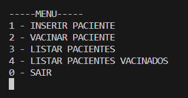
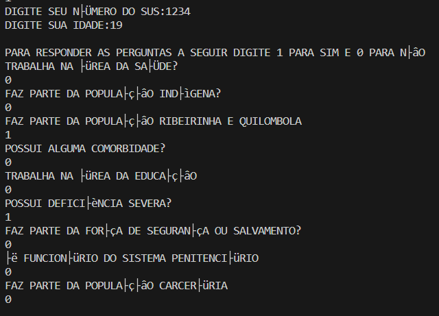
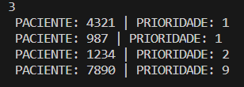
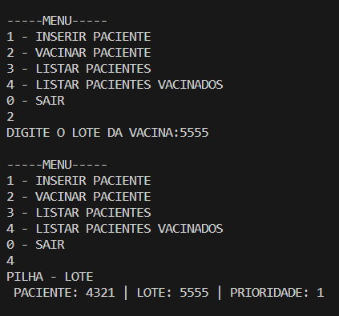

# Exercicio_avaliativo_06

Exercício avaliativo - Estrutura de Dados

# Integrantes
- Augusto G Serrano
- Caio S Lopes
- Eduardo P Carvalho

# Compilar
Para compilar o código, abra o terminal na pasta do código e digite "make", desta forma, os arquivos serão compilados. Caso seu sistema operacional seja Windows, digite "mingw32-make" no terminal.

Para executar basta digitar no terminal "./main"

# Estratégia Utilizada
A produção deste software foi feita de forma conjunta e discutida entre todos os participantes. Deste modo foram feitas reuniões em conjunto para a elaboração da lógica de negócio e do código do mesmo. Sendo assim, cada um produziu uma parte específica do código, mas tudo foi previamente discutido e acordado por todos.

# Screenshots do Sistema

# Descrição dos TADs Utilizados

- TAD paciente: possui as funções necessárias para criar e alterar os dados dos pacientes.

- TAD fila: é a implementação de uma fila utilizando LDE (lista duplamente encadeada). Para que seja possível armazenar a lista de pacientes na ordem correta.

- TAD pilha: é a implementação básica de uma pilha para armazenar todos os pacientes vacinados.